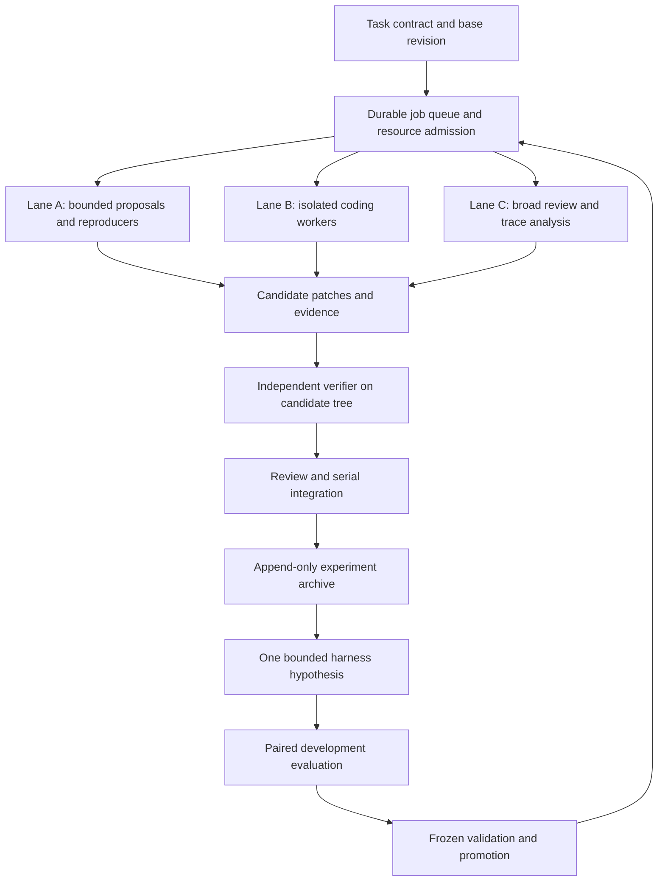

**Three-endpoint developer harness: review and rig implementation plan**

Reviewed 2026-09-08 at repository revision `6bd20c49`. This is a local source
review and an implementation handoff for the development rig. No rig endpoint
was contacted. Production code was not changed. Proposed components and
operating limits below are not claims about functionality already implemented.

The recommended objective is **more independently verified useful changes per
hour, with reproducible evidence for every promotion**. The repository has
enough foundations to build this. The first work should make verification,
isolation, experiment identity, and request admission reliable; these determine
whether additional inference capacity produces progress that can be trusted.

**The fleet we are designing for**

| Lane | User-reported endpoint | Reported capacity | Initial role hypothesis |
|---|---|---|---|
| A | LAN port 8000, Qwen 27B NVFP4 heretic | 32 concurrent requests | Bounded investigations, independent patch proposals, reproducer and adversarial-case generation |
| B | Local uncensored Qwen Next | 8 concurrent requests | Main implementation and repair loops, independent review |
| C | Normal uncensored Qwen with long context | 8 concurrent requests, up to 1M context | Cross-module review, difficult localization, inspection of long execution traces |

Exact model revisions, serving engines, URLs for B/C, tokenizer/chat templates,
and shared GPU/host topology remain unknown. Lane names avoid guessing these
identities. The older capacities and model assessments in
[model-playbook.md](model-playbook.md) and [loop-recipes.md](loop-recipes.md)
are historical observations, not measurements of this reported configuration.
Quantization, uncensoring, model name, and context size do not establish a
model's suitability for a coding role; the rig must compare the actual models.

Treat 32/8/8 as reported ceilings. They do not establish 48 simultaneous coding
jobs, or eight simultaneous full-million-token requests at acceptable latency.
Measure request capacity separately from Docker, CPU, RAM, disk, and compiler
capacity. Shared GPUs require a resource limit above the endpoint limits.

**Findings that affect the proposed loops**

P1 means address before relying on unattended promotion or fleet-wide scaling.
P2 means a material diagnostic or efficiency problem. Source paths and line
numbers refer to the reviewed revision. Reproductions below were isolated
offline probes, not live-model trials or a complete application test suite.

1. **P1 — Commands that execute no tests can receive verification credit.**
   `src/agent/tool_dispatch/helpers.rs:1063` scans interpreter-like tokens
   anywhere in a command and treats an inline string containing `assert` as a
   test. The verifier recognizer at `:1136` also accepts help/version invocations.
   Extracted-helper probes accepted `pytest --version`, `cargo test --help`,
   `python3 -c 'print("assert")'`, and `echo python3 -c assert` as verification.
   `src/agent/tool_dispatch/mod.rs:39` then credits a successful recognized tool
   call to the current mutation sequence and clears previous failure state.
   This can produce a success claim without running an applicable check.

   Introduce a verifier receipt with the executed command, check kind,
   applicability, exit status, available test counts, and tested tree hash.
   Parsing command text can identify a candidate verifier; it cannot establish
   that tests ran. Distinguish compilation, syntax, test execution, and custom
   checks. Acceptance: these no-op commands never clear a failing test receipt;
   a real passing configured check can satisfy its explicitly named requirement.

2. **P1 — Resume loses verification freshness while retaining old successes.**
   `src/agent/checkpointing.rs:96` builds a fresh Agent and restores messages,
   checkpoint tool calls, budgets, and selected guard counters. It does not
   restore the mutation and verification fields initialized at
   `src/agent/mod.rs:1391`. `src/agent/verification.rs:1075` can find a successful
   verification in the old tool log, while `:1097` treats the fresh zero counters
   as current. The stale-verification check at `:1056` requires a nonzero
   mutation counter.

   A successful test followed by a breaking edit and a restart can therefore
   lose the evidence that verification is stale. Persist verification receipts
   and source identity; on uncertain or legacy resume, require revalidation.
   Acceptance: pass → edit → checkpoint → resume → completion is refused until
   the resumed source is checked, including when files change outside the agent.

3. **P1 — Worktree and snapshot state are unsafe for concurrent in-process workers.**
   `src/tools/git_worktree.rs:32` has one process-global worktree stack;
   `:63` and `:86` change the process working directory. Another agent's tools
   can then resolve relative paths against the wrong workspace.
   `src/agent/best_snapshot.rs:22` keys the snapshot directory only by PID, and
   `:29` flattens different paths to the same filename. An isolated Rust probe
   using the actual snapshot module confirmed that `a/b.py` and `a_b.py` collide
   and the former is restored with the latter's bytes. A second snapshot
   object's `clear()` deletes the first object's saved state. Files created
   after a snapshot also survive its restore.

   Initially run each coding worker as a separate OS process with a supervisor
   assigned workspace. This mitigates cross-agent process-global state, but
   the snapshot path collision and incomplete tree restore still need fixing.
   Use unique run-owned snapshot directories and a manifest covering paths,
   contents, additions, deletions, and relevant metadata. Acceptance: concurrent
   workers cannot alter each other's cwd or snapshots, and rollback restores
   the exact captured workspace state without touching unrelated user work.

4. **P1 — Endpoint admission is not wired into the HTTP request boundary.**
   `src/concurrency.rs:73` defines `acquire_stream`, but a source-wide search
   found no production callers. Each Agent creates its own governor at
   `src/agent/mod.rs:1290`. POSTs originate directly at
   `src/api/client.rs:799` and `:1137`. The semaphore in
   `src/api/streaming.rs:14` permits 100 stream processors and is acquired at
   `:59`, after the HTTP request. It does not enforce this fleet's capacities.

   Build shared admission keyed by endpoint and shared hardware group, before
   POST, covering normal calls, profiles, reviewers, retries, and background
   consumers. Use a single supervisor/gateway or another cross-process authority;
   per-worker semaphores do not sum to a fleet limit. Acceptance: competing
   worker processes never exceed the configured admission limit, and crash,
   cancellation, and lease expiry recover capacity without double allocation.

5. **P1 — API error paths can escape timeout and cancellation budgets.**
   `src/api/client.rs:213` creates a client without a total timeout. Error-body
   reads at `:841`, `:1255`, and `:1291` await `response.text()` without a bounded
   body read or cancellation race. Headers followed by a stalled error body
   can strand a request. Separately, nonstreaming code checks the wall deadline
   at `:1070` before retry sleep, then can POST at `:1137` after that deadline;
   `:1124` grants at least another second. The success-body timeout at `:1184`
   reuses time already spent waiting for headers.

   Use one absolute deadline across queueing, backoff, headers, and body;
   recheck before every POST and cap error-body bytes. Acceptance: mock
   400/429/500 headers with a never-ending body, and backoff crossing a deadline,
   terminate with typed outcomes, launch no expired retry, and release capacity.
   Run the same checks for streaming, nonstreaming, and profile requests.

6. **P1 — Profile capability fallback leaks across endpoints.**
   `src/api/client.rs:1413` attaches native tools using a profile flag without
   consulting the fallback latch. Rejection handling at `:1297` checks and
   changes the parent client's native-tool state. One incompatible endpoint
   can disable native tools for the default endpoint, while subsequent calls
   to the incompatible profile keep attaching them. A profile enabling native
   tools under a disabled parent also misses the intended fallback.

   Scope compatibility state by effective endpoint, model revision, and request
   format. Acceptance: two mock endpoints with opposite tool support retain
   independent, persistent capability decisions for either parent default.
   The related timing issue is P2: profile timeouts at `:1118` use parent
   endpoint/output settings (`:278`, `:284`) and a shared speed tracker (`:159`).
   Alternating fast and slow profiles must not contaminate each other's timeout
   measurements.

7. **P1 — Multi-chat budget admission excludes prompt tokens.**
   `src/orchestration/multiagent/chat.rs:144` and `:172` reserve output allowance;
   `:598` admits using that amount, but `:625` settles total input plus output.
   Eight 100k-input calls with an 8k-output allowance can reserve about 64k
   against a 100k budget while consuming about 864k. Failed calls release their
   reservations without retaining unknown usage liability.

   Reserve measured effective prompt plus output allowance, with explicit
   treatment of retries and uncertain usage. Acceptance: a budget below the
   concurrent input-plus-output reservation prevents POSTs, including with
   persisted histories. Use the required shared token-counting entry point and
   compare its counts with the endpoint tokenizer and reported usage.

8. **P1 — Official evaluation selects a patch before the score is called pass@1.**
   `src/bench_harness/swebench_pro/runner.rs:1275` evaluates every candidate
   against official tests; `:1308` selects using those results and promotes
   the winner at `:1311`. The promoted result contributes to `pass_at_1` at
   `:1991`. The sibling API has the same issue:
   `candidate.rs:55` ranks by official resolution and `:82` uses that ranking
   for pass@1.

   Freeze deployable selection before official evaluation. Report first-sample
   resolution, frozen-selector resolution at k attempts, and oracle best-of-k
   separately, with total resources. Acceptance: changing hidden labels cannot
   change the frozen selection; a failed selected candidate plus a successful
   alternative remains selected=false, oracle=true. Existing tests that encode
   the old semantics need an explicit contract-change explanation, preserving
   oracle functionality and obeying AGENTS.md if assertions are weakened.

9. **P1 — Official-mode prompt filtering does not isolate grader metadata.**
   `src/bench_harness/swebench_pro/runner.rs:1066` writes the full instance to
   `candidate_dir/instance.json`. `dataset.rs:24` retains fail-to-pass fields,
   selected test files, and arbitrary extra dataset fields. The agent runs in
   the sibling `repo` directory via `harness.rs:302`, without a filesystem
   isolation boundary around generation. Read-only shell operations are
   exempted from the path allowlist at
   `src/safety/checker/validation.rs:1536` and `:1563`.

   Thus `cat ../instance.json` can read metadata excluded from the official
   prompt unless separately denied. Gold-patch exposure depends on the actual
   dataset extras; it was not established here. Give generation a sanitized
   instance and an isolated filesystem view; mount hidden evaluator data only
   into the evaluator. Acceptance: a grader canary cannot be read by a candidate
   or proposer through file tools, shell, symlinks, or inherited mounts.

10. **P1 — Partial Harbor results and repeated trials can produce inflated winners.**
    `benchmarks/harbor/harness-search.sh:46` enumerates observed directories,
    keys results only by task at `:47`, and divides by observed task count at
    `:73`. The evaluator's failure is swallowed at `:104`, and the largest
    observed mean becomes the parent at `:123`. Running the actual recorder
    against temporary fixtures confirmed that one successful observed task
    yields 1.000 despite the recorder having no way to detect seven absent
    planned tasks. Two trials of the same task with rewards 0 and 1 collapse
    into the last reward and also yield 1.000. Concurrent launches can also
    misattribute jobs because `:97` identifies a job by shared-directory diff.

    Persist the planned task × replicate matrix and a unique evaluator job ID
    before launch. Keep every replicate and terminal outcome. Incomplete runs
    remain in the archive for diagnosis but cannot be promoted. Acceptance:
    the two-replicate fixture scores 0.5; incomplete evidence cannot beat a
    complete incumbent; concurrent runs cannot exchange output directories.

11. **P1 — Experiment provenance and proposer restrictions are incomplete.**
    `src/bench_harness/swebench_pro/manifest.rs:33` omits endpoint, actual model
    revision, selfware binary hash, effective config, and dataset content identity.
    `runner.rs:431` and `:447` allow resume using that incomplete snapshot.
    Switching endpoint or rebuilding at the same path can mix old and new
    trials into one experiment.

    In the Harbor path, `proposer-skill.md:21` promises a leakage audit and
    restricted edits; `harness-search.sh:140` instead applies fuzzy patches,
    falls back to line replacement, and evaluates at `:164` without enforcing
    those contracts. The dataset is also requested as `@latest` at `:102`.

    Fingerprint the actual executable/config/model/dataset/evaluator identities.
    Parse candidate configs and enforce allowed field changes and exact parent
    identity. Enforce train/validation/holdout separation outside model prompts.
    Acceptance: changed endpoint, binary bytes, or dataset bytes invalidate
    resume; forbidden field edits, a task-specific canary, and partial patches
    are rejected before evaluation. A lexical leakage audit supplements actual
    data separation; it cannot prove the absence of overfitting.

12. **P1 — Ordinary bug fixes can be penalized for adding regression tests.**
    `src/agent/verification.rs:1012` rejects mixed source/test changes unless
    the task matches the test-writing phrase classifier at `:385`; it tells
    the model to restore the test files. A request such as “fix this parser bug”
    can therefore reject a useful source fix plus a new regression case.

    Add an explicit developer-task policy distinct from benchmark evaluation
    policy. Developer fixes should permit additive regression tests while
    retaining the original suite as a comparison. Changes that remove cases,
    weaken assertions, or subtract selected features still require the human
    sign-off specified in AGENTS.md. Acceptance: an ordinary source fix plus
    a reproducer can complete; an assertion weakening cannot silently earn
    approval; benchmark hidden tests remain immutable.

13. **P1 — Fleet telemetry reports zero violations when tests never ran.**
    `scripts/fleet_measure.py:48` ignores the Cargo return code and counts a
    phrase only in stdout. An isolated execution of the actual script with
    mocked Cargo exit 101 and a compilation error recorded and printed
    `gate_violations=0`.

    Record check status, exit code, diagnostic artifacts, and nullable violation
    count. Acceptance: pass-with-zero, actual violations, compile failure,
    infrastructure failure, and timeout are distinct results. Unknown must
    remain unknown in both dashboards and promotion logic.

14. **P2 — Candidate evidence and resource totals are insufficient for the outer loop.**
    `src/bench_harness/swebench_pro/trace.rs:39` records counts rather than model
    request/response contents; tool completion lacks full output. The application
    has other logs, but the benchmark manifest does not bind them into a complete
    candidate bundle. Worse, `trace.rs:116` rejects an entire JSONL file on one
    bad line; `runner.rs:1113` ignores that read failure and `:1137` overwrites
    the trace with only final events, potentially losing valid pre-crash data.

    Archive complete, appropriately redacted request/response/tool artifacts;
    use summaries as indexes. Preserve original traces and recover valid prefixes
    into separate derived files. Acceptance: a truncated final record never
    destroys the preceding 99 valid records or the original bytes.

    Count the resources of every candidate: `runner.rs:1320` currently promotes
    only the chosen candidate's wall time although `:1235` ran all candidates.
    Also fix `harness-search.sh:174`, which formats nullable cost as a float;
    the offline fixture reproduced its TypeError. Unknown local cost must not
    abort reporting or become zero resource use.

15. **P2 — Evolution evaluates a population but retains only its first survivor.**
    `src/evolution/daemon.rs:449` evaluates hypotheses serially; `:630` retains
    only the first passing hypothesis. The baseline comparison happens later
    at `:656`. If the first survivor is worse than baseline and a later one is
    better, the improvement is discarded. Select among all valid candidates
    using explicit quality constraints and measured objectives; parallelize
    evaluation only after resource admission and artifact isolation exist.
    Acceptance: reordering an identical set of scored candidates does not
    change the winning objective value, with deterministic tie-breaking.

16. **P1 — A failed swarm phase can become overall success.**
    `src/agent/task_runner.rs:538` executes each phase, logs failure at `:550`,
    continues, then prints a green completion message and returns `Ok(())` at
    `:560`. `src/orchestration/swarm/coordinator.rs:477` marks a task completed
    when enough result strings arrive, independently of their success flags.
    This is a second orchestration route, distinct from multi-chat; it currently
    runs serial role prompts on the same Agent.

    Aggregate typed phase outcomes, block dependent phases when their required
    inputs failed, and distinguish completed execution from verified success.
    Acceptance: an injected coder or verifier failure produces Failed/Partial,
    retains evidence, and cannot authorize integration or a green success claim.

17. **P2 — Dirty-path filtering does not establish ownership of changed bytes.**
    `src/agent/mod.rs:2585` records only tracked dirty path names at startup.
    `src/agent/verification.rs:634` excludes those whole paths from completion
    evidence. A legitimate fix to an already-dirty file can appear as EmptyDiff;
    a pre-existing untracked source file can be credited because untracked files
    were not in that baseline. Record baseline contents/existence, not just
    names. Acceptance: a worker edits an initially dirty tracked file alongside
    unrelated pre-existing untracked files and receives credit only for its own
    changes. Private worktrees reduce this exposure but do not fix interactive
    development or recovery on an existing dirty workspace.

**Architecture to build around the existing code**

The current multi-chat path makes one completion per role without tools
(`src/orchestration/multiagent/chat.rs:358`) and clamps concurrency to 16
(`types.rs:11`). Use it for opinion gathering if useful. A developer fleet
needs tool-using worker processes, persistent jobs, and a supervisor.

Start with one supervisor and a local durable queue, for example SQLite with
transactions and WAL on the supervisor's local disk. Remote workers should use
the supervisor API, not a database file shared over a network filesystem. Jobs
need run/task/candidate IDs, a base revision, dependency IDs, a lease owner and
expiry, a deadline, resource reservations, attempt identity, and typed outcomes.
Workers heartbeat; a lost worker becomes an interrupted attempt with its evidence
retained. It must not silently turn into a second successful execution.

The supervisor launches one `selfware` process per workspace, pins the binary
and effective config, and owns termination of the whole process group. Tool
execution should receive an explicit workspace root. Initially admit whole
workers conservatively; later put admission at every model request to use slots
efficiently while workers compile or inspect files. All model consumers must
pass through the same request authority. Backoff releases an inference slot,
but retains run identity and budget accounting. A cancelled request whose
server-side work may still be running retains an uncertain reservation until
confirmed cancelled or reconciled.

Maintain independent limits for endpoint requests, shared GPU groups, long
prefills, active containers, and expensive builds on each host. Reserve request
input plus output allowance and compare measured cache pressure with an
engine-specific operating envelope. A universal token-to-KV formula is not
sufficient across different model architectures. vLLM documents KV-pressure
preemption and the effect of sequence and batched-token limits; these must be
measured for the installed engine/model combination.
[vLLM tuning documentation](https://docs.vllm.ai/en/stable/configuration/optimization/)

Routing uses capability requirements first, then measured success and latency
for the task class. A long-context requirement cannot silently fall back to a
smaller window. An endpoint outage yields a typed infrastructure outcome and
checkpoint, or a separately recorded compatible retry. Model retries must not
blindly replay mutating tools: use a tool journal and reconcile ambiguous
execution before attempting the action again.

**The three development loops**

**Loop 1: make one useful code change.** Each job starts with a contract:
problem, acceptance criteria, base revision, permitted files, required checks,
budget, and whether it is a developer change, benchmark repair, or read-only
investigation. A controller owns these facts; the worker cannot redefine them
to achieve completion.

1. Reproduce or establish the relevant baseline. For a concrete bug, preserve a
   failing case. For a review, require file/line evidence and a plausible trigger.
2. Gather bounded context around the failure and dependencies. Scouts return
   evidence paths and hypotheses, not untraceable summaries or votes.
3. Make one coherent patch in a private worktree. Distinct alternatives receive
   distinct worktrees. One task owner reconciles contributions.
4. Run the cheapest applicable check after a coherent edit, then repair using
   the actual error. Avoid a full workspace rebuild after every small file write.
   Allow additive regression tests for developer tasks. Read-only investigations
   should never be forced to mutate source to satisfy a progress heuristic.
5. Ask an independent reviewer to inspect the task, diff, and verification
   evidence. Require a counterexample, failing test, or precise code path for a
   blocking finding. Same-family model agreement is not independent proof.
6. Run required gates on the candidate tree. Before every commit, the repository
   requires `cargo fmt --check` and `cargo clippy --all-targets -- -D warnings`.
   Run relevant tests and the applicable broader CI checks before promotion.
7. Integrate serially onto the current branch, then rerun affected gates on the
   integrated state. Bind approval to the resulting tree hash. A rebase, conflict
   resolution, or later edit invalidates earlier receipts for changed content.

Stop/replan based on observable progress: repeated identical tool failures,
the same failing check after repeated attempts, or a context request that the
endpoint cannot satisfy. Use task-specific budgets measured on the rig. Do not
apply a universal “write by step N” rule to research or observation tasks.

**Loop 2: turn failures into durable regressions.** Lane A can explore the same
bug class across sibling code paths, propose small cases, and generate malformed
tool or endpoint responses. A deterministic reproducer decides whether each
case demonstrates the defect. Deduplicate by behavior/root cause as well as
text, minimize failing examples, and retain their source and expected outcome.
Prioritize actual failure paths in this review: fake verification, resume
freshness, snapshot collisions, endpoint stalls, budget oversubscription, and
grader visibility. More corpus rows are not themselves an improvement.

A fix is complete only after the AGENTS.md sibling-path sweep: streaming and
nonstreaming and profiles; daemon and apply and ordinary worker tools; every
candidate selector and report. Preserve any distinct failing cases discovered
by the sweep. Existing assertions and selected features remain subject to the
repository's explicit subtraction sign-off rule.

**Loop 3: improve the harness itself.** A proposer reads development traces and
produces one bounded hypothesis, for example “the repair loop repeats reads
because the verifier output was truncated.” Record the evidence, proposed
change, predicted effect, and what would falsify it. Initially search typed
configuration and small policy surfaces; treat Rust changes as separately
gated code candidates. Keep the evaluator, hidden tests, promotion rules, and
production supervisor outside the proposer's mutable workspace.

Compare the incumbent and challenger on the same planned tasks and replicate
IDs, interleaving runs to reduce time/load confounding. Match resource budgets
and record scheduling conditions. Temperature and seed are controlled variables,
not a guarantee of identical output under changing serving batches. vLLM's
separate batch-invariance support illustrates why serving configuration belongs
in experiment identity; support and performance for this rig remain to be tested.
[vLLM batch invariance](https://docs.vllm.ai/en/stable/features/batch_invariance/)

Use three explicit sets: development data visible to the proposer, validation
for infrequent selection, and an untouched holdout for frozen promotion checks.
Repeatedly inspected validation failures eventually become development data;
version the split and avoid claiming fresh generalization from them. Separate
related task families or repositories when feasible. Archive rejected and
infrastructure-failed candidates as well as winners.

Promote only with complete required evidence, no disallowed regression, and a
meaningful quality/resource result under a predeclared comparison rule. Use
paired task-level uncertainty; do not treat correlated samples from one task
as independent tasks. Start with a modest suite and a few repeated trials to
debug the experiment, then expand where uncertainty affects the decision.
No fixed tiny sample count proves an improvement. Preserve a Pareto set of
quality, latency, and resource use rather than hiding tradeoffs in one score.

**Context and evidence contracts**

Use `crate::token_count::estimate_content_tokens` and the existing
`evolve::context_fit::TierMeasurer`/`evolve::envelope` for repository projections.
Reserve system/tool schemas, history, and output explicitly. Do not resurrect
fractional context-sizing shortcuts. There is a further calibration gap:
`src/token_count.rs:52` caches one tokenizer process-wide, and `:138` maps all
Qwen names to a Qwen2.5 tokenizer. That is not verified exact accounting for
the three deployed models. Record tokenizer revision and fallback status and
compare against server counts before operating near a context boundary.

Use the smallest evidence set that answers the task, then escalate from local
symbols to dependencies, modules, or broad repository context. The 1M lane is
valuable when omitted cross-module information is the bottleneck, not as a
default payload size for every edit. For repeated investigations, use stable
repository/context prefixes keyed by source revision and append changing task
material. Prefix caching can reduce shared-prefill work; it does not reduce
new-token decode work. Verify support and cache hits on the deployed engine.
[vLLM prefix caching](https://docs.vllm.ai/en/stable/features/automatic_prefix_caching/)

The proposed candidate bundle should contain:

| Artifact | Required identity/evidence |
|---|---|
| Run manifest | Task/split/replicate IDs; base and candidate tree hashes; binary/config/prompt/tool-policy hashes; endpoint/model/tokenizer/engine identity; deadlines |
| Request records | Effective context or immutable artifact references, truncation decisions, request/attempt ID, queue/prefill/decode timings labeled provider-reported/derived/unknown, finish reason, usage provenance |
| Tool records | Full relevant arguments, stdout/stderr artifacts, exit status, workspace identity, mutation journal, applicability |
| Verification receipts | Exact tested tree, command/check kind, applicable checks and observed test counts where available, status, evaluator/image identity |
| Candidate records | Parent, hypothesis, exact patch/config change, all trials and failure outcomes, selected/oracle distinction, aggregate resources |
| Review and promotion | Evidence-backed findings, sibling sweep, any required subtraction sign-off, frozen selection and promotion decision |

Retain raw relevant traces with credentials redacted at capture and appropriate
local access. Summaries should link to originals. Treat repository text and
trace contents as task data, not instructions that can alter the supervisor or
grading contract. Missing accounting is explicit: measured, estimated, or
unknown. A local endpoint's dollar charge can be zero while its occupied time,
tokens, power, or opportunity cost are material.

**Rig calibration before full utilization**

First record each endpoint's actual identity and serving configuration from
the rig. A successful `/models` response is insufficient: run a small generation
and a tool-call round trip, including tool-result history, Unicode, JSON/schema
behavior, streaming termination, and cancellation. Record incompatible features
per endpoint instead of assuming identical behavior because all are Qwen.

Then measure a staged load ladder. For A, try 1, 2, 4, 8, 16, 24, 32 admitted
requests; for B/C, 1, 2, 4, 6, 8. These are test points, not recommended steady
state. Exercise representative short, medium, and long input/output lengths;
increase the C lane toward 1M only after smaller requests work. Include cold
and warm prefixes and mixed short/long workloads. Stop increasing load when
completion latency, queueing, errors, or cache pressure exceed the chosen
operating objective. Measure shared-host combinations as well as each endpoint
alone. Do not immediately run the Cartesian product of every configuration.

Capture queue wait, time to first token, decode rate, p50/p95 completion latency,
valid tool-call rate, cancellation recovery, prompt/output usage, and memory
pressure. Measure independent container/build limits with the intended workload.
SGLang exposes token usage, cache hit rate, and timing metrics; inspect the
installed version's names rather than assuming these are available unchanged.
[SGLang production metrics](https://docs.sglang.io/docs/references/production_metrics)

Next give all three models the same representative developer tasks: localized
repair, multi-file repair, regression-test construction, bounded review, and
long-context diagnosis. Record verified success and time/resources per successful
result. Use historical playbook observations to choose probes, not to rule out
the current model before testing it. Only then assign routine capacity among
proposals, implementation, review, and regression generation. Keep measured
headroom for repair and interactive requests; long reviews must not starve the
workers that can finish an almost-complete patch.

**Implementation order and completion criteria**

| Increment | Concrete deliverable | Required proof before moving on |
|---|---|---|
| 1 | Verification receipts, conservative resume, accurate gate telemetry; correct snapshot identity/restore | Offline fault fixtures for findings 1–3 and 13 pass |
| 2 | Candidate/evaluator isolation, hidden-label-independent selection, complete trial identity and immutable experiment fingerprints | Findings 8–11 fixtures pass; hidden canary inaccessible; interrupted run resumes without mixing experiments |
| 3 | Supervisor, isolated worker launch, durable leases, host and endpoint admission, bounded API deadlines, typed phase aggregation | Multi-process mock fleet cannot oversubscribe; worker/proxy failure recovers capacity; no expired retry; failed required phase prevents success |
| 4 | Endpoint-scoped capabilities, circuit breakers and measurements, measured prompt/output reservation, explicit developer/test policy | Opposite-compatibility endpoints stay independent; long prompts respect budgets; source plus regression test succeeds |
| 5 | Complete candidate bundles, valid-prefix trace recovery, full-attempt resource accounting | Interrupted trace preserved; every required trial/accounting gap visible; bundle sufficient to diagnose decisive action |
| 6 | Rig-only capability/load matrix and representative task baseline | Actual endpoint and environment operating limits recorded; routing hypotheses compared |
| 7 | One end-to-end developer job with independent review and serial integration | Reproducer → patch → check → review → integration all refer to verified source states |
| 8 | Paired harness experiments and frozen promotion with rollback | Deliberately regressing and incomplete candidates rejected; selected and oracle scores remain distinct |

Deliver these as bounded changes with meaningful acceptance tests, preserving
existing features. Every fix includes the same-bug-class sweep. No step requires
claiming that the remote rig was tested here. The worker runtime can initially
reuse `selfware run`; the supervisor and evaluator enforce the new contracts
around it while the request-level plumbing is improved.

**What was checked locally**

- `cargo fmt --check`: passed.
- `cargo clippy --offline --all-targets -- -D warnings`: passed on Rust 1.96.0.
- Actual `fleet_measure.py` with a mocked Cargo compilation failure: confirmed
  false zero violations, using temporary output paths.
- Actual Harbor recorder with temporary partial/repeated-trial fixtures:
  confirmed inflated means and the unknown-cost formatting exception.
- Actual snapshot module in an isolated Rust probe: confirmed path collision,
  shared snapshot deletion, and persistence of a newly created file on restore.
- Extracted verification helper probes: confirmed the no-op classifications
  listed in finding 1. This establishes classifier behavior, not a live-model
  exploit or a full application reproduction.
- Source-path review of routing, retry and profile behavior, resume, task
  completion, evaluator data exposure, candidate selection, archive handling,
  and evolution selection. Those findings still need their proposed regression
  tests when implemented.

Full Rust tests, optional-feature CI combinations, live inference throughput,
Docker capacity, endpoint compatibility, and model task success were not run
here. Formatting and Clippy passing do not validate those behaviors. No fixes
were applied or committed as part of this review.
