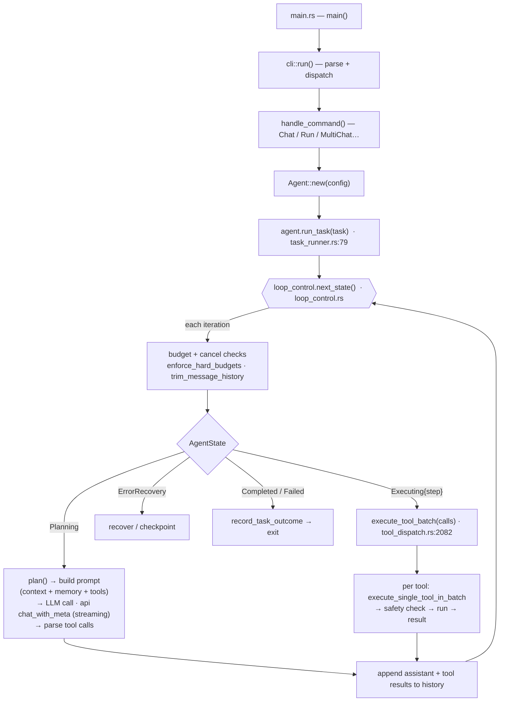

# Selfware Harness — Runtime Flow

How a task flows through the agent, grounded in the code (file:function refs).

## The spine: entry → agent loop → LLM → tools → verify

## Stages (grounded)

1. **Entry** — `main.rs:65` → `cli::run()` → `handle_command()` (`cli/mod.rs:1429`) selects
   the command and builds `Agent::new(config)`.
2. **Loop** — `run_task()` (`task_runner.rs:79`) runs a **state machine** driven by
   `loop_control.next_state()`: `Planning → Executing{step} → (ErrorRecovery) →
   Completed/Failed`.
3. **Guards first** — every iteration runs budget + cancel checks
   (`enforce_hard_budgets`, `trim_message_history`) — token/time ceilings and interrupt.
4. **Planning** — `plan()` assembles the prompt (context + memory + tool defs), calls the
   LLM (`api::chat_with_meta`, streamed), parses tool calls; checkpoints on error so the
   task is resumable.
5. **Executing** — `execute_tool_batch` (`tool_dispatch.rs:2082`) runs each tool via
   `execute_single_tool_in_batch` → **safety check → run → result**.
6. Results append to history; the loop continues until `Completed`/`Failed`.

## Clusters onto the flow

| Loop stage | Cluster |
|---|---|
| entry / drive | **Loop Core** (agent, cli, orchestration) |
| think (LLM I/O) | **Reasoning** (api, tokens, tool_parser) |
| act (tools) | **Action** (tools, computer, mcp, lsp) |
| remember / context | **Cognition** (cognitive, memory, session) |
| guard / verify | **Safety & Verify** (safety, testing, self_healing, supervision) |
| improve itself | **Evolution** (evolve, evolution, swl, analysis) |
| under everything | **Foundation** (config, errors, hooks…) |

**Key shape:** a budget-guarded *plan → act → append* loop over a state machine — LLM in
Planning, tools (behind safety) in Executing. The **Evolution cluster is a second-order
loop** that reads/analyses/rewrites the code the first loop runs on.
