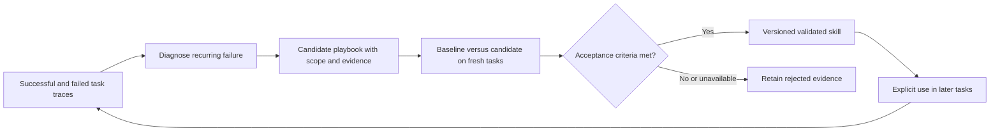

# Applying the RSI paper to Selfware: architectural review

Review basis: current checkout at HEAD `2e98b6e5`, incorporating verified fail-closed killswitch wiring, path containment, and admission ledger infrastructure. Three agents independently reviewed mutation paths, experience/skill inheritance, and evaluation/promotion; the main agent cross-checked the major findings. Static source review combined with rigorous local test verification (`cargo fmt --check`, `cargo clippy --all-targets -- -D warnings`, `cargo test --lib`).

The synthesis document (synthesized as session analysis artifact `rsi_comprehensive_synthesis.md`) was reviewed alongside the [paper](https://arxiv.org/pdf/2609.11873) and our existing [reading notes](README.md).

**Implementation and verification status:**
- **Finding 1 (SAB candidate executable contract): RESOLVED.** `SELFWARE_BINARY` is honored; versioned structured reports (`sab-report/1`) enforce executable SHA-256 validation; malformed, partial, or wrong-binary reports are strictly rejected.
- **Finding 2 (Baseline vs candidate metric comparability): RESOLVED.** Symmetric timing enforced across both arms (timing the test phase only); synthetic baseline placeholders removed; `tokens_used: Option<u64>` accurately represents unmeasured usage without falsification.
- **Finding 3 (Candidate promotion & fail-closed safety): PARTIAL.** Implemented fail-closed killswitch (`src/safety/killswitch.rs`) checkable via `SELFWARE_KILLSWITCH` env var, `.selfware/KILLSWITCH` files, or in-process atomic flags. Non-regular files (FIFOs, sockets, devices) fail closed immediately without blocking `open()`; regular files are read with a bounded 4KB buffer; HOME directory accessibility is verified before querying `$HOME/.selfware/KILLSWITCH` with `SELFWARE_KILLSWITCH_IGNORE_HOME` override. Wired into `SafetyChecker::check_tool_call` (aborting loop immediately on active killswitch), `Commands::Improve`/`Commands::Evolve` pre-spawn gates, `evolution::daemon` commit, `evolve::apply` promote gate (with typed `CommitError::Killswitch`), and `rsi_orchestrator` merge. Fixed false success signal in `ModificationEngine` (`success: false`, `applied_at: 0`). Full tournament ranking and verification-bounded promotion across all entry points remain in progress.
- **Finding 4 (Mutation paths & MetaLearner bias): PARTIAL.** Addressed proposal distortion in `rsi_orchestrator` and `self_edit`: typed `ProposalStatus` distinguishes `SkippedTrivial` (neutral, no penalty) from `VerificationFailed` (penalized), and `recently_failed_categories` filters out `SkippedTrivial`. Unification of the three mutation paths (`evolve --workflow rsi`, default `evolve`, `improve`) into a single typed pipeline remains future work.
- **Finding 5 (Candidate lifecycle & activation barrier): SCAFFOLDING.** Candidate skills are stored in `.selfware/skill-candidates/` outside active auto-discovery. Name traversal validation, symlink rejection, and SHA-256 integrity ledger (`.admitted_ledger.json`) implemented in `src/skills/mod.rs`. Provenance and verification flags are derived from the ledger rather than untrusted frontmatter (preventing bypass via flag stripping); metadata is bound to the ledger via `compute_metadata_hash`; operator CLI commands (`selfware skill [list|admit]` and `selfware killswitch [status|trip|reset]`) provide operator control. User-authored skills render clean badges (`[Skill: name]`) without unverified claims. End-to-end trace collection, empirical evaluation on fresh fixtures, and automated admission promotion are not yet implemented.

## Recommendation

Build a small, measured outer loop around existing Selfware components. First repair evaluation identity and comparability. Then run one experiment that turns session evidence into a scoped Markdown playbook and demonstrates whether it helps on fresh tasks. Broaden functional mutations after that pipeline can reliably reject ineffective changes.

The immediate objective is persistent, verified scaffold improvement. Calling it effective L5 would require a later experiment showing that a revised improvement procedure produces better subsequent improvements under comparable total budgets.

## Corrections to the supplied synthesis

- HCI describes normalized benchmark headroom closure. It is not a direct measure of intelligence, autonomy, or the causal benefit of RSI. The paper's future curves are illustrative, not measured forecasts (pp. 8–9).
- Theseus's workspace gains motivate an environment-scaffolding experiment. They do not establish that scaffolding generally outperforms weight updates; the reported comparison does not isolate that question (pp. 44–45).
- Humanlaya's V0/V4 results support a bounded persistent-update case. Its approximately 59% relative defect reduction and 43.8% handling-time reduction do not independently establish compounding ROI or improvement of the improver (pp. 46–47).
- The TODO/FIXME bottleneck is specific to particular Selfware paths. The default daemon already generates functional patches. Existing verification/worktree machinery is useful, but the source does not support describing the running outer loop as a validated L2 tournament.
- Consolidation has more than JSON storage: semantic/causal retrieval exists. The application connection to evaluated skill generation and activation is missing.

## Findings that change implementation priority

### 1. SAB does not honor the candidate executable contract

Rust passes the binary to evaluate through `SELFWARE_BINARY` in [fitness.rs:82](/Users/ivo/selfware/src/evolution/fitness.rs:82). The shell runner sets `BIN` to its own repository's release executable in [run_full_sab.sh:21](/Users/ivo/selfware/system_tests/projecte2e/run_full_sab.sh:21), builds that repository at line 118, and invokes that binary at line 165. Evaluating a worktree through this runner can therefore test the original checkout's executable.

The output contract is also inconsistent. Rust searches for an aggregate JSON report, while this runner produces per-scenario files and a Markdown report. The fallback parser in [fitness.rs:176](/Users/ivo/selfware/src/evolution/fitness.rs:176) treats numeric colon-separated lines as scenario scores and derives test/exit flags from score thresholds. Such output cannot establish which scenarios actually passed.

**Proposed change:** a versioned structured result with run ID, executable/tree hashes, task-manifest and evaluator hashes, explicit scenario outcomes, and missing-data errors. Verify the selected executable; reject malformed, incomplete, or mismatched reports. A runner contract test should use distinguishable fixture executables so using the wrong one necessarily fails.

### 2. Baseline and candidate metrics do not measure the same work

Baseline timing starts before check/test/fmt/clippy/release-build and is recorded at [daemon.rs:174](/Users/ivo/selfware/src/evolution/daemon.rs:174). Candidate timing records only the test phase at [daemon.rs:224](/Users/ivo/selfware/src/evolution/daemon.rs:224). Latency contributes to fitness, and any composite increase can trigger promotion at [daemon.rs:659](/Users/ivo/selfware/src/evolution/daemon.rs:659).

Both SAB and compile/test baseline failures can substitute fabricated baseline values via [daemon.rs:235](/Users/ivo/selfware/src/evolution/daemon.rs:235) and its callers at lines 338/353. Compile/test mode also records zero token usage and labels test pass rate as coverage. Neither is evidence of actual agent token efficiency or code coverage.

**Proposed change:** one evaluator implementation for both arms, explicit timing boundaries, separate build and task costs, and unavailable metrics represented as unavailable. Prevent promotion when baseline measurement fails. Measure task capability separately from structural compilation checks. Account for proposal, evaluation, and failed-candidate costs when claiming improvement efficiency.

### 3. Candidate selection and promotion need consistent semantics

The daemon retains the first passing hypothesis in [daemon.rs:630](/Users/ivo/selfware/src/evolution/daemon.rs:630). A source search found no caller for `run_tournament` outside its definition. That alternate implementation also mixes a 0–1 composite and 0–100 pass percentage at [tournament.rs:263](/Users/ivo/selfware/src/evolution/tournament.rs:263).

Apply offers valuable base-revision and exact-diff binding at [apply.rs:743](/Users/ivo/selfware/src/evolve/apply.rs:743), but its authoritative staging check is compilation only ([apply.rs:26](/Users/ivo/selfware/src/evolve/apply.rs:26)). It commits through libgit2 at line 843, so the shell pre-commit hook cannot supply missing fmt/clippy checks on this path.

**Proposed change:** preserve interactive staged status as a compilation result; require additional explicit acceptance before autonomous promotion. Rank eligible candidates under the same metric. Bind promotion to the evaluated artifact and unchanged base. Run `cargo fmt --check`, `cargo clippy --all-targets -- -D warnings`, and relevant tests before commits. Preserve test assertions and user-selected features; test-count checks alone cannot detect assertion weakening.

### 4. Three mutation paths should share infrastructure

| Entry path | Actual current behavior |
|---|---|
| `evolve --workflow rsi` | Restricted TODO/FIXME target selection, marker replacement, then comment-only rejection |
| Default `evolve` | Functional LLM patches, worktree evaluation, first-passing selection |
| `improve` | Restricted target selection followed by a full agent task |

Entry points are in [cli/mod.rs:2390](/Users/ivo/selfware/src/cli/mod.rs:2390), line 2487, and line 2517. Legacy restriction and marker replacement are in [self_edit.rs:372](/Users/ivo/selfware/src/cognitive/self_edit.rs:372) and line 638. The rejection gate is in [rsi_orchestrator.rs:364](/Users/ivo/selfware/src/cognitive/rsi_orchestrator.rs:364).

The restriction is not a useful functional proposal strategy. However, it is not accurate to say every marker edit is rejected: scanning is not comment-aware, and inline comments/string literals can behave differently. Preserve the existing comment-only rejection assertion ([rsi_orchestrator_test.rs:441](/Users/ivo/selfware/tests/unit/cognitive/rsi_orchestrator/rsi_orchestrator_test.rs:441)).

Before broader proposals, also address narrower legacy deny lists, direct file-copy promotion without revision/digest checks, and a language-insensitive triviality heuristic. The heuristic strips Markdown heading/bullet lines and can misclassify meaningful prompt changes. Unsupported/no-effect proposals currently feed negative effectiveness into the meta-learner; distinguish skipped proposals from measured harmful interventions.

**Proposed change:** preserve CLI workflows as adapters to a shared typed candidate/evaluation/promotion pipeline. Start with one allowlisted prompt-construction target already supported by `MutationTargets.prompt_logic`. Sweep protection and artifact identity across daemon, legacy RSI, apply, and any future tournament caller. Freeze evaluator dependencies, configuration, budgets, and task manifests per experiment.

### 5. Trace-to-skill generation should use richer evidence and a separate admission step

Completion calls consolidation in [checkpointing.rs:614](/Users/ivo/selfware/src/agent/checkpointing.rs:614). The implementation bypasses LLM summarization, keeps the first five tool previews, and leaves actions/outcomes/insights empty at [checkpointing.rs:855](/Users/ivo/selfware/src/agent/checkpointing.rs:855). The failed-checkpoint path at line 912 does not consolidate. Existing records alone would provide lossy evidence biased toward completed sessions.

Use the typed task-outcome seam in [learning.rs:95](/Users/ivo/selfware/src/agent/learning.rs:95), richer centrally redacted [session_log.rs:431](/Users/ivo/selfware/src/agent/session_log.rs:431) and line 659 events, and checkpoint verification evidence. Include successful, failed, and partial outcomes. Treat traces as untrusted evidence; a successful tool invocation is not proof the task succeeded.

Selfware already has a Markdown skill registry. Current discovery registers any parseable skill at [skills/mod.rs:126](/Users/ivo/selfware/src/skills/mod.rs:126); the schema lacks generated-origin validation and applicability state. Interactive invocation inserts the body into system instructions at [interactive/mod.rs:1771](/Users/ivo/selfware/src/agent/interactive/mod.rs:1771). Therefore writing model-generated text straight into active skill directories would skip evaluation. Parsed `tools` metadata should not be mistaken for enforced capability restrictions.

**Proposed change:** store generated candidates outside automatic discovery, for example `.selfware/skill-candidates/`. Track source trace IDs, content hash/version, task/repository scope, procedure, checks, counterexamples, evaluation evidence, and lifecycle state. Apply one admission rule across discovery, headless CLI, dashboard, and both interactive invocation paths. Generated names must not replace user skills. Begin with explicit selection; add automatic retrieval once benefit and scope are demonstrated.

## A concrete first experiment

Proposed pilot: an inspection playbook for changes that have downstream callers. Select it only if actual traces establish this recurring failure class; otherwise use the most clearly supported failure class in the available evidence.

This is a proposed loop, not current implemented behavior. The initial playbook could require tracing callers, checking relevant existing tests, applying a scoped change, and checking downstream behavior. Its wording must be distilled from evidence and tested rather than assumed effective.

Compare skill enabled versus disabled on identical fresh fixtures under the same model/config, evaluator, and resource limits. Isolate each arm's global memory and skills to prevent contamination. Include unrelated tasks to detect over-application. Record retrieval/selection, actual activation, exact content hash, and outcomes. Repeat/interleave stochastic runs and report uncertainty. Include skill-context overhead through `crate::token_count::estimate_content_tokens`; use provider usage where available for actual request costs, preserving missingness.

Define the acceptance criterion before looking at results: verified task improvement on the targeted class, no critical invariant regressions, and resource use within explicit limits. Do not infer a capability gain from schema validity, compilation, or merely saving a skill. Later model/tool/repository changes should trigger revalidation. Disable a harmful generated version while preserving evidence, user skills, and the prior working version.

## Implementation sequence and meaningful checks

| Increment | Deliverable | Evidence required |
|---|---|---|
| 1. Reliable evaluation | Candidate identity, structured reports, paired measurement, unavailable-baseline handling | Wrong-binary fixture fails; malformed/missing/incomplete reports cannot promote; both arms use identical timing/task definitions |
| 2. Experience and candidate lifecycle | Outcome-aware trace export, structured candidate storage, shared skill admission | Failed/partial evidence retained; unvalidated/tampered/off-scope generated skills cannot activate through any entry point; user skills cannot be overwritten |
| 3. One measured inheritance pilot | One scoped playbook, fresh-task evaluation, versioned activation and rollback | Actual activation attributable; held-out outcome/cost evidence; regressions rejected; evaluated bytes equal activated bytes |
| 4. Broader scaffold search | Existing CLI workflows share candidate pipeline; controlled prompt mutations | Existing no-op assertions retained; protected paths and stale promotion rejected everywhere; all eligible candidates ranked consistently |

Workspace orientation is a useful second experiment: Selfware already provides component cards and measured map sizing in [map.rs:76](/Users/ivo/selfware/src/evolve/map.rs:76) and workspace orientation at line 91. Compare focused orientation with current context on unfamiliar-repository tasks before adding another indexing system. Treat the map as navigation, with source retrieval supporting factual claims, as the code already specifies.

L3-style practice selection can follow when recorded failures and evaluations are trustworthy: select or construct practice tasks conditioned on demonstrated weaknesses, while keeping acceptance tasks separate. L5-style revision of the proposer or diagnosis procedure should come later, with the revised procedure frozen and tested on its ability to produce better descendants under matched total budgets.

## Review limits

Findings above are supported by source inspection, call-site analysis, and verified unit test execution (`cargo test --lib`). Fail-closed safety gates, tool choke point enforcement, typed error propagation, and candidate admission ledger infrastructure are verified in the codebase. Multi-round empirical evaluation on held-out tasks and live frontier model experiments remain future work.

## Reconciliation of the five-part implementation blueprint

The blueprint provides useful candidate workstreams, but its classifications, guarantees, and sequencing need these corrections:

| Blueprint statement or action | Required correction |
|---|---|
| The loop is mathematically unable to accept any change | The marker-based legacy path is severely constrained, but scanning is not comment-aware and inline/literal edits are not guaranteed to be rejected. The default daemon is a separate functional mutation path. Keep the no-op gate and replace the inadequate proposal mechanism through shared infrastructure. |
| `rsi_orchestrator` is L5 | A module name or persistent code editing does not establish L5. Identify a revised improvement mechanism, demonstrate its inheritance and reuse, then separately test whether it produces better successors. |
| Create four new harness modules immediately | First identify one existing prompt-construction seam and its behavioral test. Modularize further when needed for controlled changes; moving prompts, routing, context, and retries simultaneously expands scope and confounds attribution. Context sizing must retain measured projections and the existing token-count API. |
| Consolidation provides 32 LLM streams in the runtime learning loop | `max_concurrent_llm = 32` is a configurable ceiling in `src/consolidation/config.rs`, not evidence that task completion invokes that engine. The reviewed completion path bypasses the LLM compactor. Two analyst passes should be evaluated for added benefit and cost rather than treated as required architecture. |
| Generate active skills and compiled tools directly | Generate separately stored candidates, evaluate them, and admit the exact validated version through a shared gate. Start with Markdown using existing tools. Repeated command sequences alone do not establish safe parameterization, applicability, or reusable tool correctness. |
| Cap the registry at 50 and retire zero-contribution skills | Fifty is an unvalidated design choice. Start with configurable limits and measured context/retrieval costs. Lack of observed use is not evidence of no value. Any retirement policy should govern generated artifacts and preserve user-selected skills; deletions require the repository's explicit sign-off where applicable. |
| Run `cargo clean` as default environment refinement | Do not equate cache deletion with the paper's information-scaffolding interventions. It can impose build cost and distort comparisons. Use isolated task fixtures, consistent cache conditions, and focused navigation evidence. Reserve cleaning for an identified stale-artifact problem. |
| Maps and recent commits guarantee large gains or bound hallucinations | The paper's percentages are results from different workspace pilots, not a Selfware forecast. Evaluate map/context changes locally. Recent commits and failure logs are scoped evidence with provenance and trust handling; an arbitrary five-commit window need not be useful. |
| No-regression intersection is sufficient for acceptance | Require the same complete task manifest and task identities, explicit outcomes for every required case, no protected invariant regressions, and positive benefit under the declared objective. Missing, skipped, or timed-out evaluations must not disappear from the failed set and create a vacuous pass. A no-op also satisfies no-regression, so that condition alone is insufficient. |
| SHA-256 is a cryptographic signature | SHA-256 identifies content; it does not authenticate a signer. Use accurate digest terminology and bind the evaluation record to the exact artifact and base revision. |
| `trust_state = structural` means compiler/lint pass | Existing grounded-review semantics in `src/evolve/assistant.rs` mean citation-valid, complete evidence with structural checks only. Preserve that meaning. Record compilation, lint, regression-suite identity, completeness, and behavioral evaluation as explicit evidence fields or a separate typed evaluation state. |
| `cargo check` and clippy satisfy repository Rule 1 | Every commit requires `cargo fmt --check` and `cargo clippy --all-targets -- -D warnings`; relevant tests add behavioral evidence. Changes removing user-selected features or weakening assertions need explicit human sign-off recorded in the commit or change review. |

Revised order: validate the in-progress evaluator fixes and promotion gates; create one outcome-aware trace-to-candidate experiment; establish benefit and controlled activation; then broaden prompt mutations and compare workspace orientation variants. Learn to select practice tasks only after this evidence loop works. Defer changes to the improvement procedure itself until successor-quality comparisons are credible.
